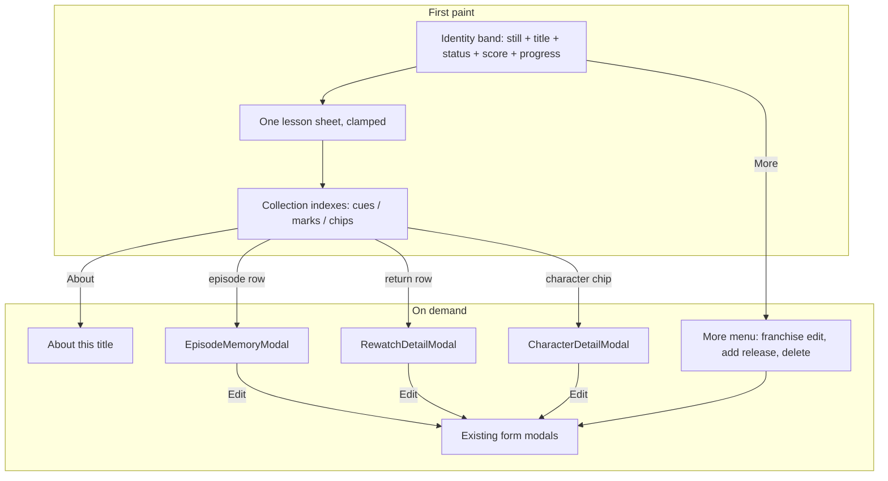
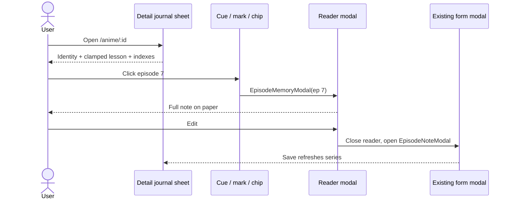

# Detail page: visual design

Companion to `README.md` (why) and `implementation.md` (how). This file is the visual and information-architecture spec. During implementation, fold the journal-sheet rule, clamp, indexes, and the updated mobile identity rule into `Frontend/design.md`.

## Design direction — `Journal sheet`

**Audience:** one person opening a title to remember where they are and what it taught them.

**Page job:** Orient you to this title, then let you read **one** lesson — never all of them at once.

**Signature:** a single reading column. Identity is a modest still beside the title. The only paper on the page is one clamped lesson sheet. Episode memories, returns, and characters are scan indexes (cue rows, dated marks, portrait chips). Full writing lives in reader modals, as if pulled from the desk drawer.

This is a deliberate reversal of “lessons first on every list.” It is justified here because the current page has no first read: every note is paper, so none of them is.

### Why this is not a generic detail dashboard

A default media-detail page is: big poster column, score box, metadata table, then a stack of cards. This page refuses the catalog rail. Facts that are not needed to orient (genres, studios, dates, Japanese/romaji titles) sit in **About this title**. Score is a number in the fact line, not a SCORE monument. Paper appears once.

### Relationship to Still & Spine

Keep walnut desk, Fraunces titles, Source Sans UI, Source Serif on paper, IBM Plex Mono for counts/scores, semantic status colors, rating bands, seal for delete, `--return-mark` pip for “writing exists.”

Do **not** introduce `--folio-paper` / `--folio-ink`. Tea-stained `--page` is the signature; the bug was volume, not hue. Do not clone the `/rewatches` spine (year headers, stem, `--cel` nodes) onto episode cues or character chips.

## Page job

| Priority | Surface | Answers |
|---|---|---|
| **First eye landing** | Identity band: modest still, Fraunces title, selected release, status, score, progress if in-progress | Where am I? What is the state of this watch/read? |
| **Secondary** | One lesson sheet for the selected release/book (`notes`), clamped if long | What did this title teach me? |
| **Tertiary** | Scan indexes: episode cues, return marks, character chips | What else is in this journal? |
| **On demand** | Reader modals (episode / rewatch / character); in-place expand of the lesson; About this title; More menu | The full record, when the user has chosen a target |

The takeaway stays the **only paper on the page**. It no longer competes because nothing else is paper until a modal opens.

## Disclosure table

| Field / section | Default on first paint | Collapsed / more | Modal | Notes |
|---|---|---|---|---|
| **Poster / cover** | Shown, modest (120×168 desktop, 72×100 mobile) in the identity band | — | — | Status 3px edge kept. No sticky monument. |
| **Title** | Shown, Fraunces. Anime = `series.title`. Book = `book.title` | — | — | Japanese/romaji not here. |
| **Author** (book) | Shown once, italic serif under title | — | — | Not repeated in a stats box. |
| **Selected release** | Shown as the active chip + in the fact line (`Season 2` / film title) | — | — | Switching chips swaps poster, facts, lesson, episode index, return filter. |
| **Release switcher** | Up to **5** chips (`S1`, `S2`, film title). Watching dot + rating number if rated | If >5: selected + 4 others + `All N releases` expands the rest in place | — | Add Season / Add Movie are **not** always-visible; they live in More. |
| **Status** | **Once**: fact-line `.status-indicator` + poster edge | — | — | Remove eyebrow duplicate and stats-row duplicate. |
| **Score** | **Once**: fact-line mono number with rating-band class, or `—` if null | — | — | Not on the lesson sheet. Not a 24px SCORE box. |
| **Progress** | Shown in the fact line. **Stepper only if `WATCHING` / `READING`**. Else mono count (`12 eps`, `340 pages`) | — | — | Planned with no progress: omit the count, do not show `0 / N` as if started. |
| **Dates** | Not in the identity band | About this title: Started / Finished (omit missing parts) | — | Anime today only prints `start_date` as “Logged”; this restores `finish_date`. |
| **Genres** | Not in the first viewport | About this title, `.genre-tag` | — | Tertiary graphite. |
| **Studios** | Not in the first viewport | About this title, `.studio-tag` | — | One place. |
| **Franchise metadata** | Not shown | About: `japanese_title`, `romaji_title` if present | — | Currently unused in the view. |
| **Takeaway (`notes`)** | **Shown**, one `.lesson-sheet`. Clamp to **8 lines** (~17px / 1.65) with fade + `Read full lesson` | In-place expand / `Show less`. Not a modal | — | Empty: same sheet, invitation CTA. Rating stripped from the slip. |
| **Episode memories** | **Index only.** Up to **5** cue rows (ep number, title or `Untitled`, rating or `—`, pip). Story order (`episode_number` asc) | `N more memories` reveals remaining **rows** (still no body text) | Click row → **new** `EpisodeMemoryModal` (reader). `Log` → existing `EpisodeNoteModal` (form) | Full `ep.note` must not mount on first paint. Per-row `Rewatch Ep N` moves into the reader footer. |
| **Rewatches** | **Index only.** Compact return-mark rows for **this release** (date, Pass N, rating, pip). Show all if ≤6, else 4 + `N more` | `N more in this franchise` reveals franchise-scoped rows (still compact). `Log` creates for the selected release | Click row → existing `RewatchDetailModal` | Reuse `passNumbers()` from `rewatchSpine.ts`. Hide “View franchise” in the modal when already on this series. |
| **Characters** | **Portrait strip.** Up to **8** chips (56px still + name + pip if `why`) | `+N` expands remaining chips | Click chip → existing `CharacterDetailModal` | Do not mount `CharacterCard` (168px, edit, delete) on this page. Edit/delete live in the modal. |
| **Edit (release / book)** | One `Edit` in the identity band → existing `EntryModal` | — | — | Opens the **selected** season/movie or the book. |
| **Edit franchise** | Not shown | More menu → `Edit franchise` | — | |
| **Add season / movie** | Not shown | More menu | — | |
| **Delete** | Not shown | More menu, seal styling, existing `ConfirmDialog` | — | Never icon-only next to Edit. 44px target. |
| **Log episode / rewatch / add character** | One secondary button per collection heading | — | Opens the existing **form** modal | Indexes are for finding; headings hold the create action. |

## Information architecture





## Layout — abandon the sticky two-column rail

The 360px sticky rail is a catalog sidebar. It duplicates facts, pins a poster while the user tries to read, and on mobile is already `order: 2` because it fights the lesson. Desktop and mobile become the **same IA**: one reading column, max-width ~860px (not 1400px with a 360px monument). Poster shrinks into the identity band so it orients without dominating.

### Desktop (≥961px)

```
[ ← Anime journal ]

┌─ .detail-identity ──────────────────────────────────────────────┐
│ ┌──────────┐  Frieren: Beyond Journey's End                     │
│ │ 120×168  │  Season 1 · WATCHING · 8/10 · 4 / 12 eps  [−][+]   │
│ │  still   │                                                    │
│ │ 3px edge │  [S1] [S2] [Film]                    [Edit] [More] │
│ └──────────┘                                                    │
└─────────────────────────────────────────────────────────────────┘

┌─ .lesson-sheet (the only paper) ────────────────────────────────┐
│ SEASON 1 LESSON                                          [Edit] │
│ Source Serif, 17px / 1.65, ink on --page.                       │
│ Clamped at 8 lines; fade; [Read full lesson]                    │
└─────────────────────────────────────────────────────────────────┘

Episode memories          6 logged                    [Log memory]
┌─────────────────────────────────────────────────────────────────┐
│  3   The still that stayed          9   ◌                       │
│  7   Beyond the journey             8   ◌                       │
│ 11   Untitled                       —   ◌                       │
│ …                                                               │
│                         3 more memories                         │
└─────────────────────────────────────────────────────────────────┘

Returns                   2 passes                    [Log rewatch]
┌─────────────────────────────────────────────────────────────────┐
│  14 Aug 2026    Pass 2    9    ◌                                │
│  02 Mar 2025    Pass 1    8                                     │
│              1 more in this franchise                           │
└─────────────────────────────────────────────────────────────────┘

Characters                4 remembered                [Add]
  ( Fern )  ( Frieren )  ( Himmel )  ( Heiter )

[ About this title ▾ ]
```

### Mobile (≤960px; 390px is the verify width)

```
[ ← Anime journal ]

┌─ identity (not reordered below the lesson) ─┐
│ [72×100]  TITLE                             │
│           S1 · WATCHING · 8                 │
│           4 / 12 eps  [−] [+]               │
│           [S1] [S2] [Film]   [Edit] [More]  │
└─────────────────────────────────────────────┘

.lesson-sheet (clamped)

Episode memories  6     [Log]
  cue rows (44px)

Returns  2              [Log]
  mark rows (44px)

Characters  4           [Add]
  wrapping chips

[ About this title ▾ ]
```

**Mobile rule change:** `Frontend/design.md` currently says the takeaway appears before catalog poster chrome. That rule assumed a 360px poster block. A 72×100 still beside the title **is identity, not catalog chrome**. Catalog chrome (genres, studios, dates, franchise titles, delete) stays in About, below the lesson. Update the design-system rule accordingly.

Tablet (641–960): same single column as mobile, slightly larger still (96×134). Do not revive a two-column rail at 768.

## Per-section visual language

One desk, four crafts. No second theme.

| Section | Metaphor | Tokens / classes | What color may do |
|---|---|---|---|
| Identity | Still on the desk | `.detail-identity`, `.detail-identity-poster`, existing `.poster-edge-*`, `.status-indicator`, `.rating-band-*`, `.release-pill-btn` (compact chip size) | Status edge and selected chip wash. Score uses rating bands only. |
| Lesson | One paper sheet | `.takeaway-slip.lesson-sheet`, `--page`, `--ink`, existing `.slip-{status}` left edge | Status on the 3px rule only. Never a gold fill panel. |
| Episode memories | Cue sheet | `.memory-cue-list`, `.memory-cue-row`, `--font-mono` for numbers, `--return-mark` pip | Rating color on the **number**. No `--cel` bars. |
| Returns | Dated marks | `.return-marks`, `.return-mark-row`, reuse pip | Rating on the number. No year stem, no target-type node palette on this page. |
| Characters | Portrait chips | `.character-strip`, `.character-chip` | Tungsten only as focus ring. Pip = paper presence. |
| About / More | Quiet facts | `.about-title` (`<details>`), graphite labels, `.genre-tag` / `.studio-tag` | Seal on Delete only. |

Reuse `--return-mark` for “writing exists” on cues, marks, and chips. That pip already means *paper is in the drawer*. Do not add a second pip color.

New tokens: **none required**. If clamp-fade needs a stop color, use `var(--desk)` in the gradient. Do not add `--folio-*`.

## Takeaway treatment

**Keep it as the primary reading surface. Redesign the object. Stop using it as the default empty-state for every section.**

It stays secondary to identity (title is the landing) and primary among *lessons*. It no longer competes because:

1. It is the **only** `--page` rectangle on the sheet.
2. Rating, status, and section-heading duplication are removed from the slip (the fact line and a short `SEASON 1 LESSON` label on the sheet are enough).
3. Long notes clamp to 8 lines on first paint. Expanding is in place, not a third modal — this *is* the page’s reading job.
4. Episode/rewatch/character bodies are gone from the scroll.

Implementation: add a `clamped` variant to `TakeawaySlip` rather than a new paper component. Class: `.takeaway-slip.lesson-sheet`. Tokens stay `--page`, `--ink`, `--ink-muted`, status left-edge (existing `.slip-watching` etc.). Type: Source Serif **17px / 1.65** (not 19px). Clamp via CSS `-webkit-line-clamp: 8` plus a desk-colored fade and a `Read full lesson` button that toggles `aria-expanded` and removes the clamp.

Empty: same sheet, `.slip-empty`, copy: `No lesson captured yet.` CTA: `Write the lesson` → `onEditSeason` / `onEditMovie` / `onEdit` (book). Do not use the current long “A title without notes is incomplete” sentence on a page that is already quiet.

## Progressive disclosure, concrete UI

### Episode memories — cue sheet

Not a spine, not paper, not a card grid. A **cue sheet**: hairline rows on the desk, IBM Plex Mono episode numbers in a 2.5rem column, title in Source Sans, rating-band number, `--return-mark` pip (episode notes require `note`, so the pip is almost always on; keep it so an empty-title row still signals “there is writing”).

```
.memory-cue-row  (button, min-height 44px)
  [  3 ]  The still that stayed     9  ◌
```

- First paint: **5 rows**, `episode_number` ascending (story order).
- `N more memories` is a button that sets `expanded` and renders the rest as the **same row component**. Bodies stay unmounted.
- Empty: one muted sentence + the heading’s `Log memory`. **No** empty `TakeawaySlip`.
- Click / Enter / Space opens `EpisodeMemoryModal`.
- `aria-haspopup="dialog"`; focus returns to the row on close.

`EpisodeMemoryModal` (new) mirrors `RewatchDetailModal` / `CharacterDetailModal`:

| Block | Content |
|---|---|
| Header | `Episode memory` + close |
| Identity | `Episode {n}` · optional title · rating band |
| Paper | Full `note` on `TakeawaySlip` (or the same `.lesson-sheet` material). Empty should not happen (API requires note); if it does, invitation to edit |
| Footer | `Edit` → close, call `onOpenEpisodeNotes` (existing form). `Log a rewatch of Ep N` if `onAddRewatchEpisode`. Seal `Delete` via existing `onDeleteNote` + confirm |

Do not open `EpisodeNoteModal` for reading. It is a dense form with number inputs and image upload.

### Rewatches — return marks (not a cloned spine)

Compact dated rows. No year headers, no stem, no type-color nodes on this page (the global `/rewatches` spine already owns that language).

```
.return-mark-row  (button, min-height 44px)
  14 Aug 2026    Pass 2    9    ◌
```

- Default filter: **this release** (season id / movie id, including episode-target rewatches of that season).
- Pass numbers: `passNumbers(allRewatches)` from `rewatchSpine.ts` (per-target, oldest dated = Pass 1). Delete local `Watch #N` `passMap` in `FranchiseDetailView`.
- If other franchise passes exist, a quiet text button `N more in this franchise` switches the filter to `all` and shows those rows too (scope label `Season 2` / `Film` / `Franchise` appears only in the all-franchise list).
- Click → `RewatchDetailModal` with `passNumber`, `onEdit`, `onDelete`. Wire `openEditRewatchModal` / `handleDeleteRewatch` from `App.tsx` (today they are only passed to `RewatchesView`).
- When `rewatch.series_id === series.id`, hide `View franchise` (already here).
- Empty: one sentence + heading `Log rewatch`. No empty slip.

### Characters — portrait strip

Horizontal wrapping chips, not `CharacterCard`.

```
.character-chip  (button, min-height 44px)
  (56px still)  Fern   ◌
```

- Pip if `why` is non-blank.
- First paint: 8 chips; `+N` expands.
- Click → existing `CharacterDetailModal` (keep the cover/gallery handlers already in `FranchiseDetailView`).
- Edit/delete are **not** on the chip. They already exist inside the modal / via `onEdit` in the modal header.
- Empty: one sentence + `Add`.

### Metadata — About this title

Native `<details>` / `<summary>` (no new library). Closed on first paint. Contains a definition list:

- Format: `Season N · TV` / `Film` / `Book`
- Studios (anime) / Author is already in identity (book: do not repeat)
- Genres
- Started / Finished (omit blanks; never print the word `Logged`)
- Japanese title / Romaji title if present

About is facts, More is actions. Optional quiet `Edit franchise` link at the bottom of About is allowed so keyboard users who open About can act without hunting.

## Book parity

`BookDetailView` uses the same `.detail-page` column:

1. Back to Book Journal.
2. Identity: cover, title, `by {author}` if present, `READING` (or other) · score · pages stepper **only if READING**.
3. Lesson sheet from `book.notes`, same clamp.
4. No episode / return / character blocks.
5. About this title: genres, started, finished, page count when not reading (label `Length`, `{n} pages`).

Banker green owns the poster edge, status chip, and stepper `tone="reading"` — same as today. Do not invent a book-only layout.

Shared markup should live in small presentational pieces so the two views do not drift:

| Piece | Used by |
|---|---|
| `DetailIdentity` | Anime + book (slots for chips / stepper / more menu) |
| `TakeawaySlip` `lesson-sheet` | Anime + book |
| `AboutTitle` | Anime + book (facts via children) |
| `MemoryCueList` | Anime only |
| `ReturnMarks` | Anime only |
| `CharacterStrip` | Anime only |
| `EpisodeMemoryModal` | Anime only |

Keep these in `Frontend/src/components/`. Do not create `utils.ts`.

## States

| State | Behavior |
|---|---|
| **Selected release** | Chip `aria-pressed="true"`, status dim wash + 3px semantic edge (existing pill classes). Poster, fact line, lesson, episode index, and default return filter all bind to `selectedType` + `selectedId`. Characters stay franchise-scoped. Default selection remains: first `WATCHING` season, else first season, else first movie. |
| **No cover** | `.detail-identity-poster` well, `Tv` / `BookOpen` 28px, mono `No still` / `No cover`. Do not leave a 360px hole. |
| **Unrated** | Fact line shows `—` with `.rating-band-empty`. No “Unrated” label in a SCORE box. Chips omit the star. |
| **WATCHING / READING** | Tungsten / banker edge, watching dot on the chip, stepper in the fact line (`ProgressStepper` unchanged). |
| **COMPLETED** | Spine edge, mono count only (`12 eps` / `340 pages` / `110 mins`), no stepper. |
| **PLAN_TO_WATCH / PLAN_TO_READ** | Night edge. Omit progress entirely if `progress` is 0 and nothing has started. Lesson empty-state is the CTA. |
| **ON_HOLD / DROPPED** | Patina / ash edge. No stepper. |
| **Empty lesson** | `.slip-empty` invitation. |
| **Empty episodes / returns / characters** | One sentence under the heading, no fake paper. |
| **Long lesson** | 8-line clamp + `Read full lesson`. After expand, `Show less` at the bottom of the sheet. |
| **Long episode/rewatch/character text** | Never on the page. Modal body scrolls (`max-height: 90vh`, existing pattern). |
| **Many releases (>5)** | Chip overflow as specified. |
| **Many memories (>5)** | Cue overflow as specified. |
| **Film selected** | Hide the episode block (same as today). Returns still show. |
| **Series with only movies** | Identity chips are films; no episode section. |
| **Rewatch without dates** | Row date `—`. Pass number still from `passNumbers()`. |

## Accessibility

- Keyboard: tab identity → chips → Edit → More → lesson CTA → cue rows → mark rows → chips → About. Enter opens. Escape closes modals. Focus returns to the triggering row/chip.
- 44px targets on chips, rows, Edit, More, Log, stepper. Delete is never a 13px icon beside Edit.
- `aria-pressed` on release chips. `aria-haspopup="dialog"` on index rows. `aria-expanded` on the lesson clamp control and on `N more` buttons.
- `prefers-reduced-motion`: no entrance tween (modals already honor this).
- Native `<details>` for About; do not replace it with a clickable `div`.
