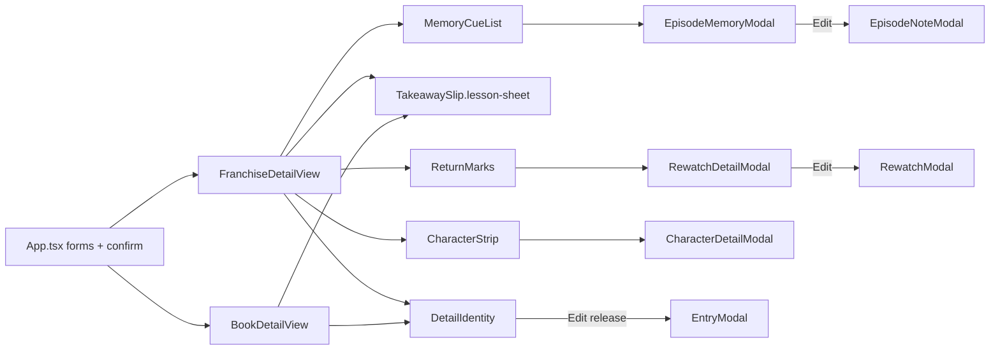

# Detail page: implementation

Companion to `README.md` (why) and `design.md` (what it looks like). Frontend only. No serializer, model, or URL changes.

## Files

| File | Change |
|---|---|
| `docs/plans/detail-page-premium-redesign-plan.md` | Add superseded banner, same pattern as `rewatches-journal-premium-redesign-plan.md`. |
| `Frontend/src/views/FranchiseDetailView.tsx` | Replace `.detail-split-layout` dump with identity + lesson + indexes + About. Mount `RewatchDetailModal` + `EpisodeMemoryModal`. |
| `Frontend/src/views/BookDetailView.tsx` | Same identity + lesson + About. No collections. |
| `Frontend/src/App.tsx` | Pass `onEditRewatch` / `onDeleteRewatch`. Extend `onOpenEpisodeNotes(season, note?)`. |
| `Frontend/src/components/EpisodeMemoryModal.tsx` | **New** reader. |
| `Frontend/src/components/DetailIdentity.tsx` | **New** shared identity band. |
| `Frontend/src/components/MemoryCueList.tsx` | **New** episode index. |
| `Frontend/src/components/ReturnMarks.tsx` | **New** detail-page return index (do not reuse `RewatchTimeline` year groups). |
| `Frontend/src/components/CharacterStrip.tsx` | **New** portrait chips. |
| `Frontend/src/components/AboutTitle.tsx` | **New** `<details>` facts block. |
| `Frontend/src/components/TakeawaySlip.tsx` | Additive `clamped` / `lesson-sheet` class. Do not change dashboard callers. |
| `Frontend/src/components/EpisodeNoteModal.tsx` | Accept optional preselected `EpisodeNote` when opened from the reader. |
| `Frontend/src/index.css` | New `.detail-page*` / `.memory-cue*` / `.return-mark*` / `.character-strip*` / `.lesson-sheet` / `.about-title`. Delete dead detail CSS listed below. |
| `Frontend/design.md` | Journal-sheet subsection: first landing, paper withheld on indexes, mobile identity rule, no `--folio-*`. |

Do not change serializers, models, URLs, `RewatchTimeline.tsx` (global tab), or `CharacterCard.tsx` (characters tab).

Keep these in `Frontend/src/components/`. Do not create `utils.ts`.

## Interface additions (frontend only)

**None at the HTTP layer.** DRF payloads already include `notes`, `episode_notes[]`, `rewatches` (via `allRewatches` prop), `favorite_characters`, `japanese_title`, `romaji_title`, dates, ratings, progress.

```ts
// FranchiseDetailView props (additions)
onEditRewatch?: (rewatch: Rewatch) => void;
onDeleteRewatch?: (id: number) => void;

// EpisodeMemoryModal
interface EpisodeMemoryModalProps {
  isOpen: boolean;
  onClose: () => void;
  season: AnimeSeason;
  note: EpisodeNote | null;
  onEdit: (season: AnimeSeason) => void; // opens EpisodeNoteModal
  onDelete?: (noteId: number) => Promise<void>;
  onAddRewatchEpisode?: (season: AnimeSeason, episodeNumber: number) => void;
}

// TakeawaySlip additions
clamped?: boolean; // default false; detail page passes true until expanded
```

`EpisodeNoteModal` already hydrates from `selectedNote` when the parent reopens it. For “Edit from reader,” extend `onOpenEpisodeNotes` to `onOpenEpisodeNotes(season, note?: EpisodeNote)` and, in `App.tsx` / `EpisodeNoteModal`, set `selectedNote` when provided. That is a small, local form-wiring change, not an API change.

`App.tsx` stays owner of form modals (`EntryModal`, `EpisodeNoteModal`, `RewatchModal`, `CharacterModal`) and `ConfirmDialog`. Detail views own reader modals (already true for `CharacterDetailModal`; extend to `RewatchDetailModal` and `EpisodeMemoryModal`).

Pass `openEditRewatchModal` and `handleDeleteRewatch` from the existing `FranchiseDetailRouteWrapper` in `App.tsx`. No new API client methods.

## Client state

- Selected release: existing `useState` (`selectedType`, `selectedId`).
- Lesson expanded: `useState<boolean>`.
- Cue / mark / chip “show all”: `useState<boolean>` per section.
- Rewatch filter: keep `'release' | 'all'`, default `'release'`; the all-franchise control becomes the `N more in this franchise` link instead of a two-segment toggle always on screen.
- Pass numbers: import `passNumbers` from `rewatchSpine.ts`; delete the local chronological `Watch #N` map.

No migrations. Progress remains a count. Rating remains 1–10 or null. Status enums unchanged.

## CSS to delete (after the new layout ships)

Confirmed unused or replaced:

- `.editorial-pull-quote`, `.editorial-pull-quote-text`, `.editorial-pull-quote-footer`, `.editorial-pull-quote-label` — leftover from the pull-quote era; no TSX references.
- `.evolving-timeline`, `.timeline-row`, `.timeline-pass-col`, `.timeline-pass-badge`, `.timeline-pass-date`, `.timeline-stem-col`, `.timeline-node-ring`, `.timeline-stem-line`, `.timeline-content-col`, `.timeline-card`, `.timeline-card-header`, `.timeline-card-title`, `.timeline-card-text` — only `FranchiseDetailView` uses `.evolving-timeline`; the rest are unused or only that section.
- `.detail-split-layout`, `.detail-sidebar` sticky rules, `.quick-stats-box`, `.stats-score-row`, `.stats-score-label`, `.stats-score-val`, `.score-total`, `.stats-divider`, `.stats-meta-list`, `.stats-meta-row`, `.meta-key`, `.meta-val`, `.meta-val-mono`, `.release-switcher-box` — replaced by `.detail-identity` + `.about-title`.
- `.detail-main-content`, `.detail-eyebrow`, `.detail-main-title` — replaced by `.detail-page` title styles (title class may be renamed, not lost).
- Mobile overrides that set `.detail-sidebar { order: 2 }` and `.detail-main-content { order: 1 }`.

**Keep:** `.detail-poster-img` can be reused at the new size; `.poster-edge-*`; `.release-pill-btn` and status/active variants (chips); `.takeaway-slip*`; `.status-indicator*`; `.genre-tag`; `.studio-tag`; `.rating-band-*`; `.rewatch-spine*` / `.rewatch-timeline*` (global tab); modal chrome.

PRs 3 and 4 must not ship a half-migrated CSS state where book detail still uses deleted `.quick-stats-box` classes — hence the delete list lives in PR 4, after book is converted.

## Phases

### Phase 1 — readers and wiring (no layout risk)

1. Add `EpisodeMemoryModal` following `RewatchDetailModal` structure (overlay, header, body, footer actions).
2. Extend `onOpenEpisodeNotes(season, note?)`.
3. Pass rewatch edit/delete into `FranchiseDetailView` but do not switch the timeline yet.
4. Add `clamped` support on `TakeawaySlip`; verify dashboard slips unchanged.

### Phase 2 — franchise journal sheet

1. Extract `DetailIdentity`, `MemoryCueList`, `ReturnMarks`, `CharacterStrip`, `AboutTitle`.
2. Rewrite `FranchiseDetailView` to the single column. Remove inline `TakeawaySlip` loops and `.evolving-timeline`.
3. Default rewatch filter `release`; franchise overflow link.
4. More menu for franchise edit / add season / add movie / delete.
5. Wire row clicks to the three readers.

### Phase 3 — book parity

1. Rewrite `BookDetailView` with `DetailIdentity` + lesson + About.
2. Confirm planned / reading / completed / unrated / no cover / long notes.

### Phase 4 — CSS delete + design.md

1. Remove dead selectors listed above.
2. Document the journal-sheet rule, clamp, indexes, and the updated mobile identity rule in `Frontend/design.md`.
3. Banner on the folio plan file (if not already landed with this folder).

## Component / data flow



## Risks

| Risk | Severity | Mitigation |
|---|---|---|
| Users who liked scrolling all episode essays lose that | Medium (intentional) | Cue expand still lists every episode; one click reads. This is the product decision. |
| Smaller poster feels “less premium” | Low | Identity still has a still; premium is hierarchy, not size. Folio plan’s large rail is what failed. |
| `EpisodeMemoryModal` is a third reader to maintain | Low | Copy chrome from `RewatchDetailModal`; do not invent new overlay CSS. |
| Forgetting to pass `onEditRewatch` | Medium | Phase 1 wiring; verification includes Edit from the return modal. |
| `TakeawaySlip` clamp leaks to dashboard | Medium | Opt-in prop; dashboard does not pass `clamped`. |
| Deleting `.evolving-timeline` while Rewatches tab still needs timeline classes | Low | Only delete `.evolving-timeline*`, not `.rewatch-timeline*`. |
| Accidental franchise delete | Medium (data loss) | Move delete into More + existing `ConfirmDialog`. Stop the 13px icon next to Edit. |
| XSS via `notes` / `why` / titles | Low | Continue rendering as React text nodes (`{text}`), never `dangerouslySetInnerHTML`. |

## Rollout

1. **Git branch** `feat/detail-page-redesign` off main. No feature flag (single-user local app; flags add dead code).
2. Land docs first (this folder + superseded banner on the folio plan), then implementation PRs below.
3. **Verify in the browser** (`webapp-testing` skill or equivalent) before merge.
4. **Rollback:** revert the frontend PR. No migration to reverse. `TakeawaySlip` variant must be additive so dashboard/book rows do not regress if the detail views are reverted alone.

## Verification

From `Frontend/`: `npm run lint` and `npm run build`.

Browser at **1280 / 768 / 390**:

- Watching season with progress stepper; completed season with count only; planned with no `0/N`; on-hold; dropped.
- Reading book stepper (`tone="reading"`); completed book length in About; planned book.
- Selected season vs film (episode block appears/disappears); switch chips; >5 releases overflow.
- Long takeaway clamps then expands; empty takeaway CTA opens edit.
- Season with 0, 3, and 12 episode notes: first paint never shows 12 papers; row opens reader; Edit opens form on that episode; Log memory still creates.
- Rewatches: this-release rows, pip vs no pip, Pass numbers match `passNumbers()`, franchise overflow, click opens `RewatchDetailModal`, Edit opens `RewatchModal`, Delete confirms, View franchise hidden on this page.
- Characters: strip not 168px cards; click opens existing modal; gallery still works; Add still works.
- No cover; unrated `—`; missing dates omitted in About; japanese/romaji appear only if set.
- Keyboard: tab identity → chips → Edit → More → lesson CTA → cue rows → mark rows → chips → About. Enter opens. Escape closes modals. Focus returns to the row.
- 44px targets on chips, rows, Edit, More, Log, stepper.
- `prefers-reduced-motion`: no entrance tween (modals already honor this).
- Delete is not icon-only beside Edit.

**Done when:**

- A glance at a dense franchise shows a title, a state, and one lesson — not a database dump.
- Episode attention is a second click, not a wall of paper.
- Status, score, and studio each appear once.
- Book page matches the IA without fake episode/rewatch sections.
- No new API field, dependency, or `--folio-*` token.

## Out of scope

- Backend, serializers, migrations, new note/highlight/tag models.
- JSON:API envelopes, URL versioning, `?release=` deep links (nice later, not required).
- Poster color extraction, image upload changes, light theme.
- Rewriting `EpisodeNoteModal` / `RewatchModal` / `EntryModal` into hybrid readers.
- Replacing `CharacterCard` on `/characters`.
- Copying the return-spine visual onto episodes or characters.
- Implementing `docs/plans/detail-page-premium-redesign-plan.md`.
- Analytics, streaks, watch-time, side-by-side first-vs-later diffs.

## Open questions (not blockers)

1. Persist selected release in the URL (`?season=12`) in a later pass.
2. Whether `EpisodeNoteModal`’s internal episode pills can later be removed once the reader+form split is habitual — out of scope; do not rewrite the form in this work.
3. Shared `More` menu primitive if Dashboard later needs one — do not abstract until a second consumer exists.

## PR Plan

Independently mergeable. Docs do not require code. Book parity can wait on the anime sheet but should not land CSS deletes that still serve the old book rail.

### PR 1 — Plan folder + supersede the folio document

- **Title:** `docs: detail page journal-sheet plan; supersede folio redesign`
- **Files:** this folder + banner on `docs/plans/detail-page-premium-redesign-plan.md`
- **Dependencies:** none
- **Description:** Split the design into the same folder pattern as `docs/plans/rewatches-timeline-modal/`. Mark the folio plan superseded so it is not implemented. No runtime change.

### PR 2 — Episode reader + takeaway clamp + rewatch edit wiring

- **Title:** `feat(frontend): episode memory reader and detail-page rewatch wiring`
- **Files:**
  - `Frontend/src/components/EpisodeMemoryModal.tsx` (new)
  - `Frontend/src/components/TakeawaySlip.tsx` (`clamped` / `lesson-sheet`, opt-in)
  - `Frontend/src/components/EpisodeNoteModal.tsx` (optional preselected note)
  - `Frontend/src/App.tsx` (`onOpenEpisodeNotes(season, note?)`, pass `onEditRewatch` / `onDeleteRewatch`)
  - `Frontend/src/views/FranchiseDetailView.tsx` (prop types + pass-through only; layout still old)
- **Dependencies:** PR 1 recommended, not required
- **Description:** Add the missing reader surface and the App callbacks the layout rewrite needs. Dashboard `TakeawaySlip` callers must not pass `clamped`. Mergeable without visual IA change if Phase 2 is delayed; the modal can be unused until PR 3 mounts it.

### PR 3 — Franchise detail journal sheet

- **Title:** `feat(frontend): franchise detail journal sheet and scan indexes`
- **Files:**
  - `Frontend/src/views/FranchiseDetailView.tsx` (layout rewrite)
  - `Frontend/src/components/DetailIdentity.tsx` (new)
  - `Frontend/src/components/MemoryCueList.tsx` (new)
  - `Frontend/src/components/ReturnMarks.tsx` (new)
  - `Frontend/src/components/CharacterStrip.tsx` (new)
  - `Frontend/src/components/AboutTitle.tsx` (new)
  - `Frontend/src/index.css` (new classes; do not delete book-rail CSS yet)
- **Dependencies:** PR 2
- **Description:** Abandon `.detail-split-layout` on the anime page. Identity band, clamped lesson, cue sheet, return marks, character strip, About, More. Mount `EpisodeMemoryModal`, `RewatchDetailModal`, `CharacterDetailModal`. Per-target pass numbers. This is the user-visible fix for `/anime/:id`.

### PR 4 — Book parity, dead CSS, design.md

- **Title:** `feat(frontend): book detail journal sheet and detail CSS cleanup`
- **Files:**
  - `Frontend/src/views/BookDetailView.tsx`
  - `Frontend/src/index.css` (delete selectors in the CSS-to-delete list)
  - `Frontend/design.md` (journal-sheet subsection; mobile identity rule)
- **Dependencies:** PR 3 (shared `DetailIdentity` / `AboutTitle` / `lesson-sheet`)
- **Description:** Bring `/books/:id` onto the same IA. Remove `.quick-stats-box`, `.evolving-timeline`, `.editorial-pull-quote`, and the old split-layout rules once no view references them. Document tokens and the list-vs-modal rule so the next redesign does not restore the dump.
