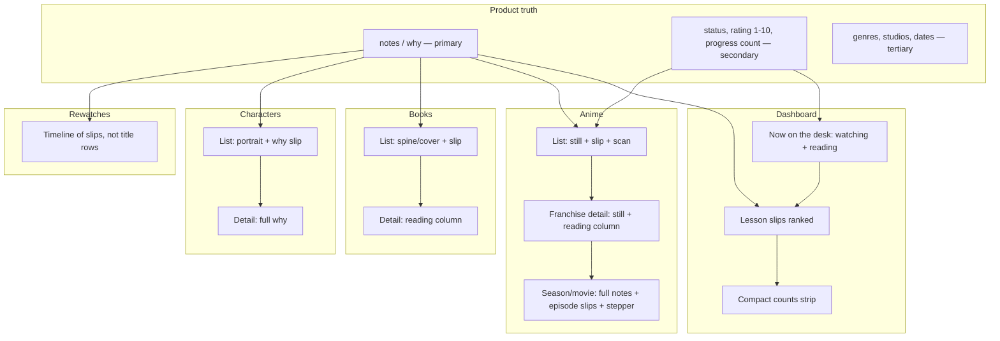
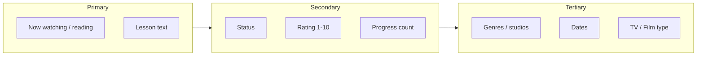
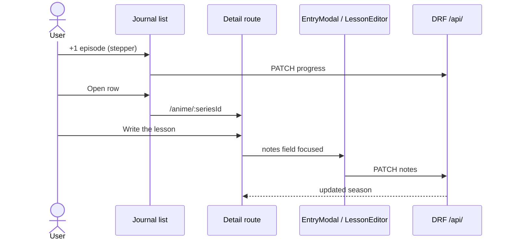

# Still & Spine: UI/UX Redesign Plan for anime_log

| Field | Value |
|-------|--------|
| **Document** | Frontend visual & information-architecture redesign |
| **Author** | TBD (implementing engineer) |
| **Date** | 2026-08-23 |
| **Status** | Draft (open questions 1–4 resolved 2026-08-23) |
| **Scope** | `Frontend/` SPA only. No backend rewrite. |
| **Product** | Personal anime/book journal of memories and lessons — not a catalog |

---

## Overview

The current SPA looks like a media-tracker dashboard. Catalog chrome (status chips, genre tags, nested franchise cards, a dense default table, 10–14px type, 4px progress bars, 20×20 character avatars) is visually loud. The product’s actual content — `notes` on seasons/movies/books/rewatches and `why` on `FavoriteCharacter` — is rendered as 13px italic quotes, often truncated, and is never given a real reading surface.

This plan replaces the failed **Midnight Archive / Modern Otaku** look (`Frontend/design.md`, indigo + violet `#6366F1`) with **Still & Spine**: a personal journal whose primary object is a **takeaway slip** pinned under a still or a book spine. Layout, type, and interaction invert today’s hierarchy: lessons first, status/rating/progress scannable, tags receding. Implementation is incremental frontend PRs. The Django/DRF contract at `/api/` does not change unless a genuine gap is found (none of the visual problems require new models).

---

## Background & Motivation

### What the product is

From root `AGENTS.md` and `Frontend/AGENTS.md`:

- This is a **journal of memories and lessons**, not MyAnimeList.
- Catalog fields (title, status, progress, rating) exist so each lesson has a home.
- A title row without `notes` / `why` is incomplete.
- Surfaces that matter: currently watching/reading, completed with lessons, plan-to-watch/read, rewatches, favorite characters.
- Rating is 1–10 or null. Progress is a **count** (episodes / pages / minutes), not a percentage as source of truth (percentage may be derived for bars).
- Status enums must stay identical to Django `AnimeStatus` / `BookStatus`.

### Current state (verified in source)

The SPA lives in `Frontend/src/`. There is **no URL routing**. `App.tsx` holds `activeTab: ActiveTab` (`'dashboard' | 'anime' | 'books' | 'characters' | 'rewatches' | 'media'`) and swaps views in a single `<main>`. Styling is a mix of tokens in `Frontend/src/index.css` (`:root` Midnight Archive) and **heavy inline styles** on almost every component.

`Frontend/package.json` has React 19, Vite 8, GSAP, lucide-react. **No React Router.** Fonts in `Frontend/index.html`: Hanken Grotesk, Inter, JetBrains Mono.

### Pain points (user-stated, confirmed)

1. **Layout makes information hard to see** — two-row sticky header, nested cards, table-as-default, equal-weight metadata competing with lessons.
2. **Detail is quite small** — notes, ratings, progress, character `why`, posters.
3. **Important info is not highlighted** — lessons should dominate; status/rating/progress should scan; tags should recede.

---

## Diagnosis: current visual hierarchy

The product says lessons are primary. The pixels say the opposite.

### What is visually loud (catalog chrome)

| Element | Where | Size / treatment |
|---------|--------|------------------|
| Sticky two-row header | `Navigation.tsx` | Brand 18px + 10px `JOURNAL` chip + 11px tagline; search 13px; 6 tab buttons at 13px |
| Metric cards | `StatsOverview.tsx` | 28px animated counters, 5 equal cards, **leads the dashboard** |
| Table default | `AnimeView.tsx` L50 | `viewMode` default `'table'` |
| Franchise table header | `SeriesTableView.tsx` | Poster **44×60** (`.franchise-poster-thumb`); title 18px; `FRANCHISE` chip **10px** |
| Franchise card | `AnimeCard.tsx` | Poster **58×80** (`.franchise-card-poster`); nested release workspace; 11px action dock |
| Status badges | `index.css` `.status-badge` | **11px** uppercase mono pills, high chroma |
| Genre / studio tags | `.genre-tag` / `.studio-tag` | **11px**, same visual weight as notes labels |
| Type badges | `.type-badge-tv` / `.type-badge-movie` | **10px** |
| Progress bars | Dashboard / table | **4px** (`DashboardView.tsx` L281, `SeriesTableView.tsx` L457); CSS default 6px; `design.md` specifies 4px |
| Stepper buttons | `.stepper-btn` | **22×22** hit target (below 44px / 24px guidelines) |
| Icon buttons | `.btn-icon` | padding 6px, icons 11–14px, `title` not `aria-label` |
| Filter chips | `AnimeView.tsx` | 13px pills + 11px counts, indigo glow when active |
| GSAP entrance | most views | opacity/y/scale staggers on every tab change |

### What is visually quiet (the journal)

| Content | Where | Size / treatment |
|---------|--------|------------------|
| Season / movie `notes` | `AnimeCard.tsx`, `SeriesTableView.tsx` | **13px italic**; label **10px** (`.editorial-takeaway-card`) |
| Episode notes | `AnimeCard.tsx` L438 | **12px italic**; table pills **11px** (`SeriesTableView.tsx` L567) |
| Book `notes` | `BookCard.tsx` L258 | **13px italic**, collapsible, behind a 12px uppercase header |
| Character `why` on franchise | `AnimeCard.tsx` L770 | **truncated to 24 chars**, 10px italic |
| Character `why` on table | `SeriesTableView.tsx` L817 | truncated to **28 chars**, 10px |
| Character `why` on card | `CharacterCard.tsx` L106 | 13px italic; avatar **44×44** (list) vs **20×20** (`.character-avatar-thumb` on franchise) |
| Rewatch `notes` | `RewatchTimeline.tsx` L161 | 13px italic |
| Dashboard spotlight | `DashboardView.tsx` L134 | **first 3** notes in nested `forEach` order — not ranked, not recency, not “has lesson” quality |
| Dashboard active titles | `DashboardView.tsx` | 11px series label, **15px** title, 11px rating pill, 13px progress count |
| Book cover | `BookCard.tsx` | **46×64** |
| Release still | `.release-still-thumb` | **48×32** |
| `EntryModal` notes field | `EntryModal.tsx` L760–776 | **last field** in a long form, `rows={3}`, 12px label — writing a lesson is buried |

### Type scale: specified vs shipped

`Frontend/design.md` specifies display **48**, headline **32**, body **16**. The running UI almost never uses those tokens. Observed running sizes:

- 10px: type badges, editorial labels, character why snippets, media ID, JOURNAL chip
- 11px: status badges, genre tags, dashboard labels, filter counts, action dock
- 12px: rating pills, many captions, form labels
- 13px: **lesson text**, search, tabs, journal quotes (`.journal-quote-text`)
- 14px: buttons, some progress counts
- 15–18px: titles on cards/table
- 20–24px: view headings
- 28px: stat counters only

**Lesson text is smaller than the dashboard heading and the same size as a tab label.** That is the core hierarchy failure.

### Default views

- Anime: **table** (`AnimeView.tsx` `useState<'cards' | 'table'>('table')`). Cards grid is `minmax(420px)` — too wide for three columns, too cramped for a reading surface.
- Books: card grid `minmax(360px)` with notes collapsed-capable (default expanded, but still 13px).
- Dashboard: stats → active grid `minmax(340px)` → spotlight `minmax(300px)`.
- No franchise/season/book/character **detail page**. Everything is crammed into the list card or a modal.

### Navigation & search gaps

- Search is global in `App.tsx` but **DashboardView does not receive `searchQuery`**. Media has its own local search. Typing in the header on Dashboard or Media does nothing useful (Media ignores the header search).
- Tabs are `<button>`s, not links: no Cmd-click, no shareable URL, no browser back.
- “Log Entry” in the header opens a franchise modal unless `activeTab === 'books'`.

### Accessibility gaps (verified)

Grep for `aria-label` / `aria-` / skip link / `role=` across `Frontend/src`: **zero matches**.

| Guideline (Vercel Web Interface Guidelines / `web-design-guidelines`) | Current failure |
|---------------------------------------------------------------------|-----------------|
| Icon-only buttons need `aria-label` | `title=` only (`AnimeCard`, `SeriesTableView`, `BookCard`, `CharacterCard`, `RewatchTimeline`, `DashboardView`, `Toast`, `MediaView`) |
| No `transition: all` | `index.css` L185, L233, L255, L337, L375, L517, L604 plus many inline `transition: 'all 0.15s ease'` |
| Skip link to main content | None |
| Visible `:focus-visible` | Only `.form-input:focus` (indigo ring). Buttons, tabs, steppers, cards have no focus ring |
| Search has a `<label>` | `Navigation.tsx` L136–149: placeholder only, no `<label>` / `aria-label` |
| Images have width/height | CSS classes set size; `` tags often omit `width`/`height` attributes (CLS) |
| Confirm destructive actions in-page | `window.confirm` in `App.tsx` (6 call sites), `MediaView.tsx`, `MediaLibraryModal.tsx`, `EpisodeNoteModal.tsx` |
| Touch targets ≥ 24px (ideal 44px) | `.stepper-btn` 22×22; `.btn-icon` ~32px; many 11px ghost buttons |
| `prefers-reduced-motion` | CSS media query exists; GSAP paths check `prefersReducedMotion()` — good. Hover `transform` still fights the spirit when not reduced |
| Tab nav as links | Buttons; no URL |
| Toasts | No `role="status"` / `aria-live` |

### Why Midnight Archive failed

`Frontend/design.md` describes “Corporate Modern with a Cinematic Edge,” “high-end personal dashboard,” glassmorphism, violet glow (`--shadow-glow: 0 0 24px rgba(99, 102, 241, 0.2)`), 4px progress bars, Inter-at-small-sizes. That is a **tracker aesthetic**. It rewards density and chrome. A journal rewards a still, a spine, and a paragraph you can actually read. Polishing indigo will not fix the hierarchy.

---

## Goals & Non-Goals

### Goals

1. Invert visual hierarchy so **`notes` / `why` dominate** every surface that has them.
2. Make **status, rating (1–10), and progress counts** scannable at a glance without competing with lessons.
3. Demote genres, studios, type badges, and completion fractions to tertiary.
4. Enlarge stills, spines, lesson type (minimum **16px** body for lesson text), ratings, and progress.
5. Replace table-as-default with a journal list; give **real detail / reading views** instead of nested mega-cards.
6. Make writing a lesson a first-class action (not a 11px icon or last form field).
7. Keep progress steppers convenient on “now watching / reading.”
8. Ship accessibility: skip link, labels, focus, no `transition: all`, confirm dialogs, 24px+ targets.
9. Replace the visual system (tokens, type, signature element) — do not polish Midnight Archive.
10. Incremental, reviewable frontend PRs. First PR is tokens + type + hierarchy on **one** surface.

### Non-Goals

- Backend/API/model changes, new quote/highlight/tag models, renaming `Backend/requirement.txt`.
- Changing `AnimeStatus` / `BookStatus` string values.
- MyAnimeList-style catalog, social features, or public profiles.
- Next.js, Django templates, HTMX, JSON:API envelopes.
- Big-bang rewrite of every view in PR 1.
- Dark-mode/light-mode toggle in v1 (see Open Questions; recommended default is dark desk + paper slips).
- Perfect recency ranking that needs `updated_at` (use existing `created_at` / `start_date` client-side).

---

## Proposed Design

### Design name: Still & Spine

A personal media journal that looks like a **desk after the credits**: a printed still (or a book spine) and a paper takeaway slip. The room is dark and warm. The lesson is always on paper. Catalog chrome stays on the desk and stays quiet.

This is **not**:

- Midnight Archive (indigo/violet glass dashboard) — the current failed look.
- Warm cream + serif + terracotta “lifestyle blog” — paper is used only for the slip, not as a full-page cream skin.
- Near-black + acid green terminal.
- Broadsheet / hairline newspaper.

### Signature element: the Takeaway Slip

**The UI is remembered by the paper slip under the still.**

Justification from the subject: the product is memories and lessons. A still without a slip is a poster shop; a table of titles is a tracker. The slip is the journal. Every season, movie, book, rewatch, and character with `notes`/`why` renders in a shared `TakeawaySlip` component: paper-colored surface, left margin rule (ballpoint, not neon), 16–18px lesson text in a reading face, optional rating in mono. Empty slips show a clear **Write the lesson** action, not a dashed 12px italic hint.

Do not rotate slips, do not use Comic Sans, do not fake torn paper. Restraint: 0–1px border, slight inner shadow, no glassmorphism.

### Color tokens (replace `:root` in `index.css`)

Named hex tokens — 6 core + semantic status (muted, not high-chroma pills):

| Token | Hex | Role |
|-------|-----|------|
| `--desk` | `#161310` | App background. Warm near-black of a wooden desk in low light — **not** `#051424` navy |
| `--desk-raised` | `#211C16` | Header, list rows, raised panels |
| `--page` | `#EDE6D9` | Takeaway slip / reading surface |
| `--ink` | `#1F1A14` | Text on `--page` |
| `--tungsten` | `#D4A05A` | Lamp light: “now watching/reading”, focus ring, primary action |
| `--spine` | `#7A3E38` | Completed / important accent (book-spine red-brown, not emerald neon) |
| `--graphite` | `#8A8174` | Tertiary metadata on desk |
| `--still-well` | `#0C0A08` | Image wells behind posters |

On-desk text: `#E8DFD0` (warm off-white), not `#d4e4fa` ice-blue.

Status color is **a 3px left edge or a small mono word**, not a glowing pill:

- Watching / Reading → `--tungsten`
- Completed → `--spine`
- Plan → `--graphite`
- On Hold → `#B56A3A`
- Dropped → `#6E3A3A` at low saturation

**Delete** `--color-primary-action: #6366f1`, `--shadow-glow`, violet gradients, `.glass-card` glow hover. Primary buttons: `--tungsten` on `--desk`, ink text, no purple shadow.

### Typography

Replace Hanken Grotesk / Inter / JetBrains Mono in `index.html`.

| Role | Face | Why |
|------|------|-----|
| Display (titles only, restraint) | **Fraunces** | Soft old-style; journal, not “tech otaku.” Use at 28–36px for franchise/book titles on detail; **do not** use for UI chrome |
| Body / UI | **Source Sans 3** | Humanist, not Inter. 16px default |
| Lesson text | **Source Serif 4** | The reading face on the slip. **Roman, not italic-by-default** (italic currently disguises notes as decorative quotes) |
| Counts / ratings / progress | **IBM Plex Mono** | Utility; 18–24px for rating and `12 / 24 eps`, not 12px pills |

#### Type scale (ship as CSS variables)

| Token | Size | Use |
|-------|------|-----|
| `--type-display` | 32px / 36px desktop | Detail title only |
| `--type-title` | 22px | List title |
| `--type-lesson` | **18px** desktop / **16px** mobile | `notes` / `why` — **minimum 16px** |
| `--type-body` | 16px | UI body |
| `--type-meta` | 13px | Genres, dates, studios (tertiary) |
| `--type-rating` | 24px mono | `8` or `8/10` |
| `--type-progress` | 20px mono | `12 / 24` |
| `--type-label` | 12px / 0.08em uppercase | Section labels only, never lesson text |

### Poster / still sizes (replace CSS classes)

| Class / use | Current | Target |
|-------------|---------|--------|
| List still (anime/book) | 44×60 / 46×64 / 58×80 | **96×144** (2:3 poster) desktop; 72×108 mobile |
| Detail still | n/a (no detail page) | **240×360** desktop; full-width max 200px on mobile |
| Release still in list | 48×32 | Drop from list; show on detail |
| Character on franchise strip | 20×20 | **40×40** minimum; full `why` on character page |
| Character detail | 44×44 | **120×120** |
| Progress bar | 4–6px | **8px** track, count is the source of truth (mono number, not the bar) |
| Rating | 11–12px pill | **24px mono number**, star optional and quiet |

### Layout concept

- **Desk** (dark) holds navigation, lists, steppers, tags.
- **Page** (paper) holds lessons — slips in lists, a full reading column on detail.
- Max content width **1080px** (today `.main-content` is 1360px, which encourages cramped multi-column cards).
- One primary column on mobile. Desktop list is still + text, not a 12-column dashboard.

#### Desktop wireframe — Dashboard

```
┌─────────────────────────────────────────────────────────────┐
| skip: Main  [Still & Spine]  search________  [Write]        |
| Home   Watching   Anime   Books   Characters   Rewatches    |
├─────────────────────────────────────────────────────────────┤
| NOW ON THE DESK                              2 watching · 1 |
| ┌──────────┐  Frieren — Season 1              WATCHING      |
| │  96×144  │  12 / 24 eps   [−] [+]            ★ 9          |
| │  still   │  ┌───────────────────────────────────────────┐ |
| └──────────┘  │ Takeaway slip: 18px lesson, or            │ |
|               │ [Write the lesson] if notes empty         │ |
|               └───────────────────────────────────────────┘ |
| LESSONS (ranked: has text, then recency — not first-3)      |
| ┌──────┐  “The journey is the point…”          Frieren  ★9  |
| │still │  Season 1 · season note                            |
| └──────┘                                                    |
| compact strip: 2 watching · 1 reading · 14 lessons (text)   |
└─────────────────────────────────────────────────────────────┘
```

Stats cards are **not** the hero. A one-line graphite strip at the bottom (or under the header) is enough.

#### Mobile wireframe — Dashboard

```
┌─────────────────────┐
| [Write]    search   |
| Home  Anime  Books …|  ← scroll tabs
├─────────────────────┤
| NOW                 |
| ┌──────┐            |
| │still │ Frieren    |
| │72×108│ 12/24 [+]  |
| └──────┘            |
| ┌─────────────────┐ |
| │ slip 16px text  │ |
| └─────────────────┘ |
| LESSONS             |
| slip / slip / slip  |
└─────────────────────┘
```

#### Desktop — Anime list (default, not table)

```
Filter: Now · Completed · Plan · Hold · Dropped · All
Sort:   Watching first, then with-lesson, then title

┌────────┐  Frieren: Beyond Journey's End
│ 96×144 │  WATCHING    12/24    9/10
└────────┘  ┌──────────────────────────────────────┐
            │ Season 1 lesson at 18px…             │
            └──────────────────────────────────────┘
            S2 · Film  (graphite, not tabs-in-card)
```

Click the row (not an 11px pencil) → **detail route**.

#### Desktop — Franchise / season detail (reading surface)

```
┌────────────┐  Frieren                    [Edit catalog]
│  240×360   │  Season 1 of 2 · WATCHING
│   still    │  12 / 24  [−][+]     9 / 10
└────────────┘
┌─────────────────────────────────────────────────────────┐
│ TAKEAWAY                              [Write / Edit]    │
│ 18px Source Serif, measure ~65ch, --page background     │
│ Full notes. Not italic-quote. Not truncated.            │
└─────────────────────────────────────────────────────────┘
Episode memories (list of slips)     Characters (name + why)
Rewatches (dated slips)              Studios / genres (footer)
```

#### Mobile — Detail

```
[ ← Anime ]
┌─────────────────────┐
│ still 100% × 200    │
│ Title 22px          │
│ 12/24 [+]  9/10     │
├─────────────────────┤
│ PAPER COLUMN        │
│ lesson 16px         │
│ [Write the lesson]  │
└─────────────────────┘
```

### Information architecture

Primary = lesson (`notes` / `why`). Secondary = status, rating, progress count, title, still. Tertiary = genres, studios, dates, type TV/Film, completion fractions, Cloudinary IDs.



#### Per-surface hierarchy

**Dashboard**

- Primary: currently watching/reading (still + progress stepper + slip) and a **ranked** lesson list.
- Secondary: rating, episode/page counts.
- Tertiary: total completed / rewatch counts as a single graphite line.
- **Cut from first screen:** five equal `StatsOverview` cards; GSAP count-up; “Explore All Journals” as a primary-looking ghost button; first-3 unranked spotlight.

**Anime list**

- Primary: still, title, takeaway (first ~280 chars of `notes` with fade, not 13px italic dump of every episode note).
- Secondary: status word, rating, `progress / total`.
- Tertiary: genre/studio; other seasons as a graphite line (“S2 · Movie”).
- **Cut from first screen:** nested release workspace, episode-note grids, 11px action docks, franchise metrics strip (Franchises / Logged Releases / TV Episodes Watched), table columns of steppers for completed titles.

**Anime / franchise detail**

- Primary: full lesson on paper; still at readable size.
- Secondary: status, rating, stepper (if watching), season/movie switcher as a simple list not pill tabs.
- Tertiary: studios, genres, dates, add-season/film.
- Episode notes: each is a slip, not a 12px nested card. Click → `EpisodeNoteModal` or inline reader.

**Book list / detail**

- Same pattern as anime. Cover as spine-like 2:3. Author is secondary (13px), not competing with title. Notes are the slip, not a collapsible 12px “KEY REFLECTIONS” accordion.

**Character**

- Primary: `why` (full text, never 24-char truncate).
- Secondary: name, series title, portrait.
- Tertiary: extra images.
- List shows the slip; detail is the reading surface. **Add Edit** (API already has `characterApi.update`; UI only has delete).

**Rewatch**

- Primary: `notes` (the deepened lesson).
- Secondary: target title, dates, rating.
- Tertiary: TV vs Film badge (today 10px chips are too loud).
- **Add Edit** (DRF `RewatchViewSet` is a ModelViewSet; frontend `rewatchApi` has list/create/delete only — add `update` in the client, no backend change).

**Media library**

- This is a **tool**, not a journal surface. Keep it visually quieter: still grid at 200px is fine; demote “Cloudinary” from the H2; use the same desk tokens; 28×28 overlay icons → 44px with `aria-label`. Header search should either drive this view or be hidden here.

**Navigation**

- One row on desktop: mark + search + Write + text links.
- Tabs become routes (see Routing).
- Drop the 10px `JOURNAL` chip and 11px tagline, or move the tagline to the dashboard intro once.

**Empty / error / loading**

- Loading: one sentence at 16px + quiet spinner; no 14px muted “Loading your reflections.”
- Empty: still-sized placeholder + **Write the first lesson** CTA, not “No Anime Found” + Film icon.
- Error: toast is not enough for initial load failure — inline retry on the view.



---

## Screen-by-screen redesign

### 1. Navigation — `Frontend/src/components/Navigation.tsx`

**Enlarge:** search control (16px text, visible `<label>` or `aria-label="Search journal"`), Write action (label **Write a lesson** / **Log entry** depending on context).

**Demote:** brand subtitle, JOURNAL chip, icon-only tab metaphors, indigo logo gradient.

**Cut from first screen:** second row of 6 equal tabs if we collapse to a single row + overflow; Media as a footer/settings link rather than a peer of “lessons.” **Recommended:** keep Media in nav but last and visually quieter.

**Change:** render tabs as `<a href>` via router (`NavLink`). Add skip link as first focusable: “Skip to journal”. Sticky header uses `--desk-raised`, 1px `--graphite` border, **no backdrop-blur glass**.

### 2. Dashboard — `Frontend/src/views/DashboardView.tsx` + `StatsOverview.tsx`

**Enlarge:** active stills to 96×144; progress counts to 20px mono; lesson slips to 18px; stepper to 32×32.

**Demote:** `StatsOverview` from hero to a compact definition list (`Watching 2 · Reading 1 · Lessons 14`) or remove from dashboard entirely (counts remain on list filters).

**Cut:** 5 glass metric cards; unranked `slice(0, 3)`; 4px bars as the only progress cue; 11px icon steppers.

**Ranking for lessons (client-only):** filter to non-empty `notes`/`why`; sort by `created_at` (seasons, movies, episode notes, books) or `start_date` (rewatches); take 5–7. Do not add `updated_at` for this.

**Search:** either pass `searchQuery` into dashboard (filter now + lessons) or disable/hide header search on this tab — do not leave a dead control.

### 3. Anime list — `AnimeView.tsx`

**Default `viewMode`: `'journal'`** (new). Table becomes optional “Compact” for power users, not the landing view.

**Enlarge:** poster, title (22px), slip, rating, progress.

**Demote:** filter chips (keep, but 16px text, no glow); view switcher.

**Cut from first screen:** `SeriesTableView` metrics strip; in-card release tab workspace; episode note dumps; character why truncation; duplicate “Log Franchise” (header already has Write).

**Incomplete rows:** if a watching/completed release has empty `notes`, show an empty slip with **Write the lesson** — product rule: a title without notes is incomplete.

### 4. Anime / franchise detail — new views

Do not cram `AnimeCard` further. Split:

- List row: `FranchiseRow`
- Detail page: `FranchiseDetail` + `ReleaseReader`

Season/movie switcher: vertical list of releases with status + rating, not `.release-tab-pill` overflow.

Writing: **Write the lesson** opens `EntryModal` in edit-season/movie with the notes field **first and large** (`rows={8}`, 16px), or a dedicated `LessonEditor` sheet.

### 5. Books — `BookView.tsx` / `BookCard.tsx`

Same list/detail split. Cover 96×144. Drop the accordion around notes. Page stepper stays on list for `READING` only; completed books don’t need a 10-page stepper on the first screen.

### 6. Characters — `CharactersView.tsx` / `CharacterCard.tsx`

Grid of portrait + why slip. No 24-char truncate. Add edit (wire existing `characterApi.update`). Delete uses in-page confirm.

### 7. Rewatches — `RewatchesView.tsx` / `RewatchTimeline.tsx`

Timeline of slips. Title + dates as a 13px header; notes 18px. Add `rewatchApi.update` + edit. Empty state already explains the product well — keep the copy, enlarge type.

### 8. Media — `MediaView.tsx`

Retheme to desk tokens; 44px actions; labelled search; hide or bind global search. Do not make this look like a journal home.

### 9. Modals — `EntryModal.tsx`, `EpisodeNoteModal.tsx`, `QuickModals.tsx`

`EntryModal` field order today: title → cover → status/rating → progress → dates → studios → genres → **notes last** (`rows={3}`).

**New order for season/movie/book/rewatch/character:** title (required) → **notes/why (large)** → status, rating, progress → everything else in a “Catalog details” `<details>` collapsed by default on create.

Focus trap, `aria-modal="true"`, labelled close, Esc to close (verify; add if missing).

### 10. Empty / error / loading

Shared `EmptyState`, `ErrorState`, `LoadingState` components using 16px body and a Write CTA. Replace per-view one-off 13px empty cards.

---

## Component plan

Prefer **CSS classes and tokens** over more inline styles. New classes live in `index.css` or colocated CSS modules; do not add a second styling system (no Tailwind rewrite in this project).

| Current | Action | Notes |
|---------|--------|-------|
| `Navigation.tsx` | **Keep, rewrite markup** | Links, skip link, labelled search, single-row layout |
| `StatsOverview.tsx` | **Replace** | `JournalStrip` (inline counts). Do not lead with 28px numbers |
| `DashboardView.tsx` | **Keep, restructure** | Now-on-desk + ranked slips; drop metric hero |
| `AnimeView.tsx` | **Keep** | Default journal list; compact table optional |
| `SeriesTableView.tsx` | **Keep as Compact mode only** | Enlarge type if kept; hide episode dumps; no metrics strip |
| `AnimeCard.tsx` | **Split** | `FranchiseRow` (list) + `FranchiseDetail` + `ReleaseReader`. Do not keep the mega-card as default |
| `BookCard.tsx` | **Split** | `BookRow` + `BookDetail` |
| `CharacterCard.tsx` | **Keep, enlarge** | Full why; add edit |
| `RewatchTimeline.tsx` | **Keep, restyle** | Slip-first; add edit |
| `EntryModal.tsx` | **Keep, reorder** | Notes first; larger textarea |
| `EpisodeNoteModal.tsx` | **Keep** | Reading + edit; enlarge note field |
| `CharacterModal` / `RewatchModal` in `QuickModals.tsx` | **Keep** | Why/notes first |
| `ImageUploadField.tsx` / `MediaLibraryModal.tsx` | **Keep** | a11y + tokens only |
| `Toast.tsx` | **Keep** | `role="status"` `aria-live="polite"`; labelled dismiss |
| `MediaView.tsx` | **Keep, retheme** | Tool, not home |
| **New** `TakeawaySlip.tsx` | Add | Shared lesson surface |
| **New** `ProgressStepper.tsx` | Extract | 32×32 buttons, `aria-label`, used by dashboard/list/detail |
| **New** `ConfirmDialog.tsx` | Add | Replace `window.confirm` |
| **New** `LessonEditor` (optional) | Add if modal remains too catalog-heavy | Sheet focused on `notes`/`why` |
| **New** route views | Add | `FranchiseDetailView`, `BookDetailView`, `CharacterDetailView` |
| GSAP in `utils/animations.ts` | **Keep, reduce** | No scale-in on every list; respect reduced motion; no bounce/elastic on content |

Do not invent components that duplicate API resources (no Quote model, no Tag chip system).

---

## Interaction

### Progress steppers — keep, enlarge, locate

Keep `seasonApi.updateProgress`, `movieApi.updateProgress`, `bookApi.updateProgress`. Extract `ProgressStepper`:

- Visible `−` / `+` with `aria-label` (“Add 1 episode”, “Add 10 pages”, “Add 10 minutes”).
- Minimum 32×32 (44×44 on mobile).
- Show the **count** at 20px mono beside the control: `12 / 24 eps`. Bar is optional decoration.
- On lists: steppers only for `WATCHING` / `READING`. Completed/plan rows are not stepper surfaces.
- Do not lose one-click progress — that is the one tracker affordance the journal still needs.

### Writing a lesson — first-class

| Today | Target |
|-------|--------|
| 11px “+ Add Takeaway” / edit icon | Button **Write the lesson** on empty slip |
| Notes last in `EntryModal`, 3 rows | Notes first, 8 rows, 16px |
| Character why truncated | Full text; edit on card/detail |
| Rewatch notes view-only after create | Edit |

A dedicated **reading surface** (detail route) is required. Do not treat 13px italic in a card as reading.

### Destructive actions

Replace `window.confirm` with `ConfirmDialog`: title, consequence sentence (“Deletes seasons, movies, and notes”), Cancel / Delete. Same copy as today is fine.

### Detail vs card

Prefer real detail views over `AnimeCard`’s nested workspace. List is for scanning and stepping progress; detail is for reading and writing.



---

## Routing

**Recommend adding client-side routes** (frontend-only). List vs detail must be a real page: deep-linkable, back-button, Cmd-click from nav.

Today `App.tsx` `activeTab` cannot bookmark a franchise or a lesson. That is a UX bug for a journal.

### Proposed routes (no API change)

| Path | View |
|------|------|
| `/` | Dashboard |
| `/anime` | Anime journal list |
| `/anime/:seriesId` | Franchise detail (default season: watching, else first) |
| `/anime/:seriesId/season/:seasonId` | Season reader |
| `/anime/:seriesId/movie/:movieId` | Movie reader |
| `/books` | Book list |
| `/books/:bookId` | Book reader |
| `/characters` | Character list |
| `/characters/:characterId` | Character reader |
| `/rewatches` | Rewatch timeline |
| `/media` | Media library |

Add `react-router-dom` to `Frontend/package.json`. Wrap `main.tsx` in `BrowserRouter`. Lift data fetching stays in `App.tsx` **or** move to a thin `JournalProvider` — do not fetch inside every card.

**Production note:** Vite dev proxy already sends `/api` to Django. Client routes are SPA-only. If Django later serves the built SPA, add a catch-all to `index.html` then; **out of scope for this redesign.** `HashRouter` is a fallback if hosting cannot rewrite — default to `BrowserRouter`.

Search: keep as React state or `?q=` on list routes so filtered lists are shareable. Recommended: `?q=` on `/anime`, `/books`, `/characters`, `/rewatches`.

---

## API / Interface Changes

**No API, serializer, or URL changes required for the visual redesign.**

DRF already exposes nested `notes`, `why`, `episode_notes`, `rewatches`, covers, progress, ratings (`Backend/animeLog/serializers.py`, `Frontend/src/types/index.ts`, `Frontend/src/api/client.ts`). Status strings already match Django `TextChoices`.

Frontend-only client gaps (not model changes):

| Gap | Evidence | Plan |
|-----|----------|------|
| No rewatch update in client | `rewatchApi` has list/create/delete only; `RewatchViewSet` is ModelViewSet | Add `rewatchApi.update` PATCH |
| Character edit unused | `characterApi.update` exists; `CharacterCard` has no edit | Wire edit UI |
| Spotlight ranking | `created_at` on seasons/movies/episode notes/books; rewatches have `start_date` only; characters have neither | Rank with existing fields; do not add `updated_at` unless a later PR needs “last edited” |

Do **not** add quote/highlight/tag models. Truncation and ranking are UI.

JSON remains DRF plain objects (no JSON:API envelope). Prefix stays `/api/` with no version segment.

---

## Data Model Changes

**None.** Schema in `Backend/animeLog/models.py` already has the journal fields:

- `AnimeSeason.notes`, `AnimeMovie.notes`, `Book.notes`, `Rewatch.notes` (`TextField`)
- `FavoriteCharacter.why`
- `EpisodeNote.note` + `episode_number` + optional `rating`
- Progress counts and rating 1–10 with model validators

Migration strategy: **n/a**. Do not rename `requirement.txt`. Do not touch `AnimeStatus` / `BookStatus` values.

---

## Alternatives Considered

### A. Polish Midnight Archive in place

Keep indigo tokens, glass cards, table default; bump font sizes 1–2px; make notes 16px italic.

- **Pros:** Smallest diff; no routing; no new fonts.
- **Cons:** Hierarchy stays catalog-first. `design.md` already specified 16px body and the UI ignored it because the **layout** (table, nested cards, metric hero) has no room for 16px lessons. Color polish without IA change is the #1 risk in this doc.

**Reject** as the primary path.

### B. Replace visual system + IA (chosen)

New tokens (Still & Spine), takeaway slip, list/detail split, routing, notes-first editing, table demoted.

- **Pros:** Matches the product definition in `AGENTS.md`. Solves all three user complaints. Incremental PRs can still land (tokens on dashboard first).
- **Cons:** More work; taste-sensitive (light slip on dark desk); routing is a new dependency.

**Accept.** The product is a journal; the UI must look like one.

### C. MAL-style catalog with notes in a drawer

Poster grid, score, progress; notes in a side drawer or tooltip.

- **Pros:** Familiar; dense; table/grid already exist.
- **Cons:** Explicitly forbidden by product rules. Notes in a drawer remain secondary. Would train the user to log titles, not lessons.

**Reject.**

### D. Light paper app (full cream canvas)

Entire UI on `--page` with serif titles.

- **Pros:** Maximum “notebook.”
- **Cons:** Collides with the banned warm-cream+serif+terracotta default; stills lose cinematic weight; long lists of watching progress feel like a blog, not a desk.

**Reject for v1.** Paper is reserved for the slip/reading column.

---

## Security & Privacy Considerations

- Personal local journal; no new auth in this redesign. Existing CSRF header in `client.ts` (`X-CSRFToken`) stays.
- Confirm dialogs prevent accidental cascade deletes (`AnimeSeries` delete wipes seasons, movies, notes).
- Media URLs: do not enlarge Cloudinary copy-to-clipboard as a journal feature; keep it in Media.
- `window.confirm` replacement must not auto-focus Delete.
- No PII logging of note bodies in `console.error` beyond what exists; prefer status toasts.
- Deep links are local-only; still do not put secrets in query strings.

Threat model is unchanged: XSS via rendered notes is possible if notes are ever `dangerouslySetInnerHTML`. Keep text as React text nodes (current pattern).

---

## Observability

This is a personal SPA. “Observability” here means **a11y, visual QA, and browser verification**, not APM.

### Accessibility checks (every PR)

- Skip link works; focus order: skip → nav → main.
- `:focus-visible` 2px `--tungsten` ring on buttons, links, steppers, slips.
- Contrast: `--ink` on `--page` and `--e8dfd0` on `--desk` against WCAG AA (verify tungsten on desk for buttons).
- `prefers-reduced-motion`: no GSAP y/scale; no slip animations.
- No `transition: all`.
- Labels on search, steppers, icon buttons.
- Toasts: `aria-live="polite"`.

### Visual QA

- Lesson text ≥ 16px on dashboard, lists, detail, empty slips.
- Stills at target sizes; no 20×20 character why.
- Table is not the anime default.
- Screenshot desktop 1280 and mobile 390 for: dashboard, anime list, one detail, empty, error.

### Browser verification (`webapp-testing` / equivalent)

Create, edit, empty, error, desktop and mobile for each surface as `Frontend/AGENTS.md` already requires. Explicit paths:

1. Increment episode on dashboard stepper; confirm count updates.
2. Write a lesson from empty slip; confirm it appears at 18px on list and detail.
3. Cmd-click Anime in nav (after routing) opens a new tab.
4. Delete franchise uses in-page confirm, not `window.confirm`.
5. Reduced-motion OS setting: no stagger.

No production metrics/alerting. Optional later: count of releases with empty `notes` on the dashboard strip (“3 watching without a lesson”) — client-side only.

---

## Rollout Plan

Incremental **frontend PRs**. Feature flags are unnecessary for a single-user learning app; use PR order instead. Rollback = revert the PR (CSS tokens are the riskiest visual blast radius — keep PR 1 to dashboard so anime table still works).

See **PR Plan** below for the ordered list.

---

## Risks

| Risk | Severity | Mitigation |
|------|----------|------------|
| Restyle without hierarchy change (bigger italic quotes on the same table) | **High** | PR 1 must move lessons above stats and set default list away from table by PR 3. Acceptance: lesson ≥ 16px and visually heavier than tags |
| Over-animation (GSAP + slip hover + still zoom) | Medium | Ban scale/bounce on content; reduced-motion first; no `transition: all` |
| Losing progress-stepper convenience | **High** | Extract stepper early; keep on dashboard and watching rows; 32×32 minimum |
| Mobile table overflow | Medium | Table is not default; compact mode `overflow-x: auto` with sticky title column if kept |
| Routing breaks in-page modal state | Medium | Keep modals in `App.tsx`; routes only select which view; do not unmount modal host on navigate |
| Paper slip contrast / “cream cliché” | Low | Slip is a component, not the app skin; desk stays dark warm charcoal |
| First PR too large | Medium | PR 1 = tokens + dashboard only; no router yet |
| Font loading CLS | Low | `display=swap` already; set explicit body line-height; img width/height |

---

## Open Questions

Resolved with the product owner on 2026-08-23 (all recommended defaults accepted):

1. **Keep compact table at all?**  
   **Decided:** yes. Journal list is the default. Compact table stays as an optional toggle.

2. **Light vs dark journal?**  
   **Decided:** dark desk + light takeaway slip. Not a full cream app. No light-theme toggle in v1.

3. **List-first vs detail-first?**  
   **Decided:** list-first (dashboard and anime/book lists). Detail is for reading and writing.

4. **Media in primary nav?**  
   **Decided:** keep it last and visually quieter. It is a tool, not a journal surface.

Still open (implement the recommended default unless a later PR notes a change):

5. **`?q=` search in the URL vs React state?**  
   **Recommended:** URL on list routes after routing lands.

6. **Should empty notes block “Completed”?**  
   Product says a title without notes is incomplete, but the model allows it. **Recommended:** do not block status in the API; nag with an empty slip CTA only.

7. **Fraunces + Source Serif 4** vs a single family?  
   **Recommended:** two families as specified. If font load is a concern, drop Fraunces and use Source Serif 4 for titles too.

---

## Key Decisions

1. **Replace Midnight Archive; do not polish it.** Tokens, type, and signature element change. `Frontend/design.md` is the failed spec and should be rewritten in the tokens PR (or replaced in place) so future agents do not “implement design.md” as indigo glass.

2. **Lessons are primary; catalog is housing.** Every list row is still + takeaway slip + scan (status, rating, progress). Tags recede.

3. **Minimum 16px lesson text; 18px desktop.** Italic-as-quote is banned as the default lesson style. Source Serif 4 roman on `--page`.

4. **Anime default view is a journal list, not `SeriesTableView`.** Compact table is optional.

5. **Real detail routes**, frontend-only, via `react-router-dom`. No Django URL changes. Mega-card (`AnimeCard`) is not the detail UI.

6. **Progress steppers stay** on watching/reading, extracted and enlarged. Progress remains a count; bars are derived.

7. **No backend/model changes** for this redesign. Wire existing PATCH for characters; add client `rewatchApi.update` only.

8. **Write-the-lesson is a labelled button** on empty slips; `EntryModal` puts notes first.

9. **Incremental PRs.** First PR: tokens + type scale + dashboard hierarchy. No big-bang.

10. **Accessibility is in-scope for each PR**, not a cleanup PR at the end: no new `transition: all`, `aria-label` on new icon buttons, focus-visible in the token PR.

11. **Status enums and rating 1–10 remain identical** to `Backend/animeLog/models.py`.

12. **Signature element is the Takeaway Slip**, justified by the journal subject (stills + handwritten takeaways), not by dashboard fashion.

13. **Product-owner confirmations (2026-08-23):** Compact table stays as a secondary toggle; dark desk + paper slip (not a full light theme); list-first navigation; Media Library remains in primary nav, last and quieter.

---

## References

- Root product rules: `/Users/letanthang/learning_software/Django_projects/anime_log/AGENTS.md`
- Frontend rules: `/Users/letanthang/learning_software/Django_projects/anime_log/Frontend/AGENTS.md`
- Failed visual spec: `/Users/letanthang/learning_software/Django_projects/anime_log/Frontend/design.md`
- Models: `/Users/letanthang/learning_software/Django_projects/anime_log/Backend/animeLog/models.py`
- SPA shell: `/Users/letanthang/learning_software/Django_projects/anime_log/Frontend/src/App.tsx`
- Tokens: `/Users/letanthang/learning_software/Django_projects/anime_log/Frontend/src/index.css`
- Franchise architecture (already shipped): `/Users/letanthang/learning_software/Django_projects/anime_log/docs/plans/series_seasons_architecture_plan.md`
- Vercel Web Interface Guidelines / `web-design-guidelines` skill (a11y items cited above)
- `frontend-design` skill: derive look from subject; avoid generic dark purple dashboards

---

## PR Plan

Ordered, independently reviewable **frontend** PRs. Do not start with a rewrite of every view.

### PR 1 — Still & Spine tokens + dashboard hierarchy

- **Title:** `ui: Still & Spine tokens and dashboard lesson-first layout`
- **Files/components:** `Frontend/index.html` (fonts), `Frontend/src/index.css` (`:root` tokens, type scale, `.takeaway-slip`, still sizes, status edges, focus-visible, remove `transition: all` on shared classes), `Frontend/design.md` (replace Midnight Archive spec), `Frontend/src/views/DashboardView.tsx`, `Frontend/src/components/StatsOverview.tsx` (replace with strip or inline), new `Frontend/src/components/TakeawaySlip.tsx`, new `Frontend/src/components/ProgressStepper.tsx`
- **Dependencies:** none
- **Description:** Swap indigo/navy tokens for desk/page/tungsten/spine. Lesson text 18px on dashboard slips. Active watching/reading uses 96×144 stills and 32×32 steppers. Stats cards no longer lead. Rank lessons instead of `slice(0, 3)`. No router yet. Anime table unchanged so rollback is easy.

### PR 2 — Navigation, skip link, labelled search, shared a11y

- **Title:** `ui: journal nav, skip link, and labelled search`
- **Files/components:** `Navigation.tsx`, `App.tsx` (`<main id="journal-main">`), `Toast.tsx` (`aria-live`), `index.css` (header classes; delete remaining glass glow)
- **Dependencies:** PR 1 (tokens)
- **Description:** Single-row header, skip link, `aria-label` on search, visible focus. Tabs remain buttons until PR 4. Hide or no-op global search on Dashboard/Media with a comment-free, user-visible behavior (disable on those tabs or filter dashboard).

### PR 3 — Anime journal list (default) + demote table

- **Title:** `ui: anime journal list as default; compact table optional`
- **Files/components:** `AnimeView.tsx` (default view `'journal'`), new `FranchiseRow.tsx` (split from `AnimeCard.tsx`), `SeriesTableView.tsx` (optional compact; drop metrics strip; enlarge type if still shown), `index.css` (list layout, `minmax` no longer 420px)
- **Dependencies:** PR 1 (`TakeawaySlip`, `ProgressStepper`)
- **Description:** Default surface is still + slip + scan. Empty notes show Write the lesson. Character why not truncated on the list (link to characters or show one line at 16px). Cards mega-workspace not used as default.

### PR 4 — Client routes + franchise/season reading views

- **Title:** `ui: SPA routes and anime reading surfaces`
- **Files/components:** `package.json` (`react-router-dom`), `main.tsx`, `App.tsx`, new `FranchiseDetailView.tsx` / `ReleaseReader.tsx`, `AnimeCard.tsx` (retire as default; keep only if compact needs it), `Navigation.tsx` (`NavLink`)
- **Dependencies:** PR 3 (list rows must navigate)
- **Description:** Routes as in the Routing section. Detail is the reading column on `--page`. Cmd-click and back button work. Modals stay mounted in `App.tsx`.

### PR 5 — Books list/detail to the same IA

- **Title:** `ui: book journal rows and reading view`
- **Files/components:** `BookView.tsx`, split `BookCard.tsx` → `BookRow` + `BookDetailView`, routes `/books`, `/books/:bookId`
- **Dependencies:** PR 4 (router)
- **Description:** Spine/cover 96×144, slip-first, no notes accordion, stepper on READING only.

### PR 6 — Characters and rewatches as lesson surfaces

- **Title:** `ui: character why and rewatch slips; wire edit`
- **Files/components:** `CharactersView.tsx`, `CharacterCard.tsx`, `RewatchesView.tsx`, `RewatchTimeline.tsx`, `QuickModals.tsx`, `api/client.ts` (`rewatchApi.update`)
- **Dependencies:** PR 4
- **Description:** Full `why` at 16–18px; 40×40+ portraits; character and rewatch edit; routes for character detail. No new models.

### PR 7 — EntryModal notes-first + confirm dialog + remaining a11y

- **Title:** `ui: notes-first editor, confirm dialog, media a11y`
- **Files/components:** `EntryModal.tsx`, `EpisodeNoteModal.tsx`, new `ConfirmDialog.tsx`, `App.tsx` (replace `window.confirm`), `MediaView.tsx`, `MediaLibraryModal.tsx`, `ImageUploadField.tsx`
- **Dependencies:** PR 2 (focus patterns); can parallel PRs 5–6
- **Description:** Notes/why first and large. In-page delete confirm. Media retheme, 44px labelled actions, img width/height. Empty/error/loading shared components if not already extracted.

### PR 8 — Visual QA pass (no new features)

- **Title:** `ui: contrast, reduced motion, and leftover inline styles`
- **Files/components:** remaining inline styles in views; GSAP usage in `DashboardView`, `AnimeView`, `BookView`, `CharactersView`, `RewatchTimeline`, `StatsOverview` (if any left)
- **Dependencies:** PRs 1–7
- **Description:** Reduce entrance motion; migrate leftover inline layout to classes; verify 390px and 1280px; ensure table compact mode does not overflow without a title anchor.

**Rollback:** revert a single PR. PR 1 is the only one that globally restyles; keep it dashboard-scoped in practice (shared `index.css` will tint other views — accept partial restyle of unmigrated pages, or gate old views behind a `.legacy-midnight` class removed in later PRs). **Recommended:** add `.legacy-midnight` only if unmigrated pages become unreadable; prefer tokens that still work on old layouts (desk background + larger type) without requiring the class.
